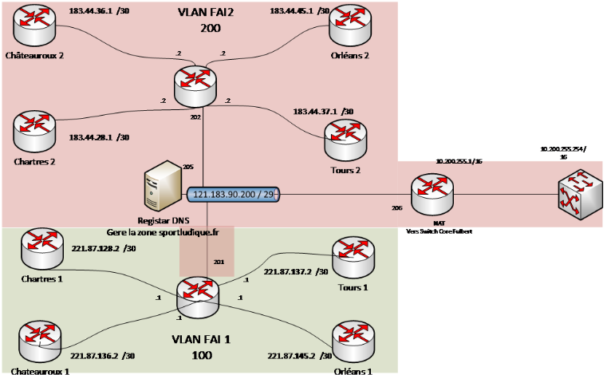

# 8/ NAT

##  **Configuration du NAT** ##

##  **Qu'est ce que le NAT ?** ##

**NAT (Network Address Translation)** est un processus de **modification des adresses IP** et **des ports source et de destination**. La traduction d'adresses **réduit le besoin d'adresses publiques IPv4 et masque les plages d'adresses réseau privées**. Le processus est généralement effectué par des routeurs ou des pare-feu.

##  **Schéma du routeur** ##

##  **Configuration des Routeurs** ##

Pour la configuration des routeurs on a commencé à faire **la configuration sur le LAN** à l'aide **d'un routeur de notre réseau (172.28.0.0/19)** qui sera par la suite connecté au routeur : **Chateauroux 1** qui a pour adresse **221.87.136.2/30**.

Nous avons commencé par **activer le IP routing** sur le routeur à l'aide de cette commande :

`conf t`

`ip routing`

###  **Configuration des interfaces** ###

Par la suite on a configurer les interfaces suivantes :

**GigabitEthernet 0/0** et **GigabitEthernet 0/1**

Selon le brassage physique que vous faites vous auriez a **définir** si le port 0/0 et le port **outside ou inside** et de même pour le port 0/1.

Dans notre cas nous avons choisis que **le port 0/0** aller être **le port outside** donc connecter avec l'extérieur (internet), et donc **le port 0/1** est donc **le port inside** donc connecter à notre réseau.

###  **Configuration ADSL** ###

**Port GigabitEthernet 0/0 :**

`conf t`

`int GigabitEthernet 0/0`

`ip address 221.87.136.2 255.255.255.252` <-- Correspond à **l'IP du routeur ADSL**

`ip nat outside` <-- Réseau **Externe**

**Port GigabitEthernet 0/1 :**

`conf t`

`int GigabitEthernet 0/1`

`ip address 172.28.3.253 255.255.255.0` <-- **Correspond à la passerelle** pour entrer dans **notre réseau LAN**

`ip nat inside` <-- Réseau **Interne**

Pour la **traduction d'adresse** :

`ip nat inside source list 1 interface gigabitEthernet 0/0 overload`

Puis on a **configurer l'IP route par défaut** :

`ip route 0.0.0.0 0.0.0.0 221.87.136.1`

`access-list 1 permit 172.28.0.0 0.0.31.255`

###  **Configuration Fibre** ###

**Port GigabitEthernet 0/0 :**

`conf t`

`int GigabitEthernet 0/0`

`ip address 183.44.36.1 255.255.255.252` <-- Correspond à **l'IP du routeur ADSL**

`ip nat outside` <-- Réseau **Externe**

**Port GigabitEthernet 0/1 :**

`conf t`

`int GigabitEthernet 0/1`

`ip address 172.28.3.253 255.255.255.0` <-- **Correspond à la passerelle** pour entrer dans **notre réseau LAN**

`ip nat inside` <-- Réseau **Interne**

Pour la **traduction d'adresse** :

`ip nat inside source list 1 interface gigabitEthernet 0/0 overload`

Puis on a **configurer l'IP route par défaut** :

`ip route 0.0.0.0 0.0.0.0 183.44.36.2`

`access-list 1 permit 172.28.0.0 0.0.31.255`

##  **Capture de trafic réseau à d'un port mirroring** ##

Le port mirroring est une fonctionnalité de gestion de réseau qui permet de copier le trafic réseau provenant d'un ou plusieurs ports d'un commutateur réseau (ou switch) vers un autre port spécialement configuré à cet effet, appelé "port miroir" ou "port de surveillance." Cette fonctionnalité est couramment utilisée à des fins de dépannage, de surveillance réseau et d'analyse du trafic. 

° Pour appliquer le port mirroring sur le **port source** :

`conf t`

`monitor session 1 source interface [nom et numéro de port] both`

° Pour appliquer le port mirroring sur le **port destination** :

`conf t`

`monitor session 1 destination interface [nom et numéro de port]`

° Pour vérifier si la fonctionnalité s'est bien appliquée :

`show monitor session 1`
