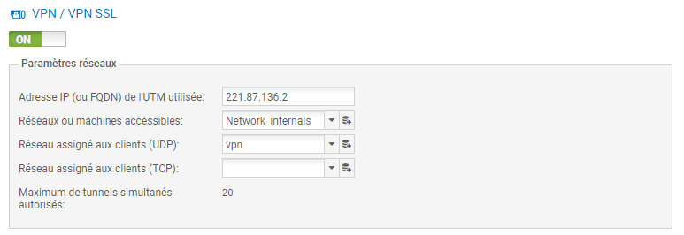

# 12/ VPN

En informatique, **un réseau privé virtuel ou réseau virtuel privé**, plus communément abrégé en **VPN**, est un système permettant de créer un **lien direct entre des ordinateurs distants**, qui **isole leurs échanges** du reste du trafic se déroulant sur des réseaux de télécommunication publics. 

## Créations des routes

### Routeur 1 et 2

**Redirection à faire** :`ip nat inside source static udp 172.28.3.2 1194 interface GigabitEthernet0/0 1194` (à faire sur les deux routeurs)

## Installation du VPN sur Stormshield

### Règles de filtrage

### Configuration annuaire

### Configuration VPN

