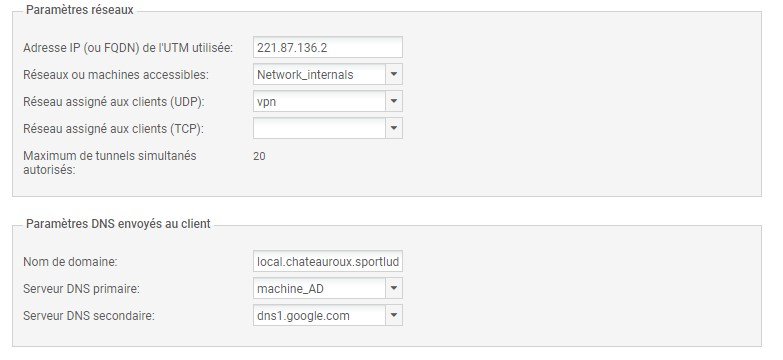

# 12/ VPN

En informatique, **un réseau privé virtuel ou réseau virtuel privé**, plus communément abrégé en **VPN**, est un système permettant de créer un **lien direct entre des ordinateurs distants**, qui **isole leurs échanges** du reste du trafic se déroulant sur des réseaux de télécommunication publics. 

## Créations des routes

### Routeur 1 et 2

**Routeur 1** :`ip nat inside source static udp 221.87.136.2 1194 interface GigabitEthernet0/1 1194`

**Routeur 2** :`ip nat inside source static udp 183.44.36.1 1194 interface GigabitEthernet0/1 1194`

## Installation du VPN sur Stormshield

### Règles de filtrage

### Configuration annuaire

### Configuration VPN

