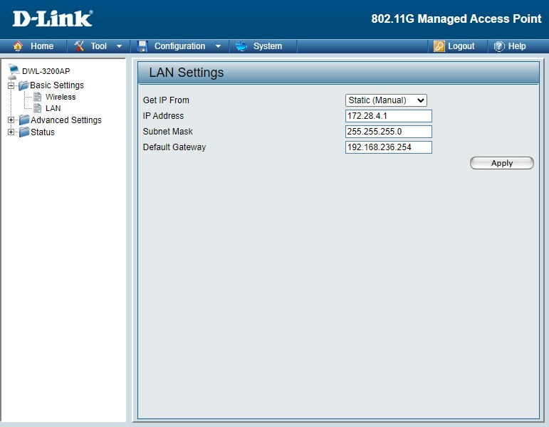

# 12/ WIFI

Pour la mise en place de la borne Wi-Fi : Nous avions décidés de configurer 2 **SSID**, le but de cela est de **différencier les utilisateurs de deux réseaux**.  1 SSID appelé **"LAN-Chateauroux"** pour les personnes ne voulant aucun accès ethernet juste un lien avec le reste du réseau et pour finir **"USER-Chateauroux"** qui permet aux personnes faisant partis du **VLAN USERS** un accès internet et à l'ensemble du réseau.

##  **Configuration du switchcore** ##

###  **Configuration borne Wi-Fi** ###

####  **Configuration borne Wi-Fi** ####

