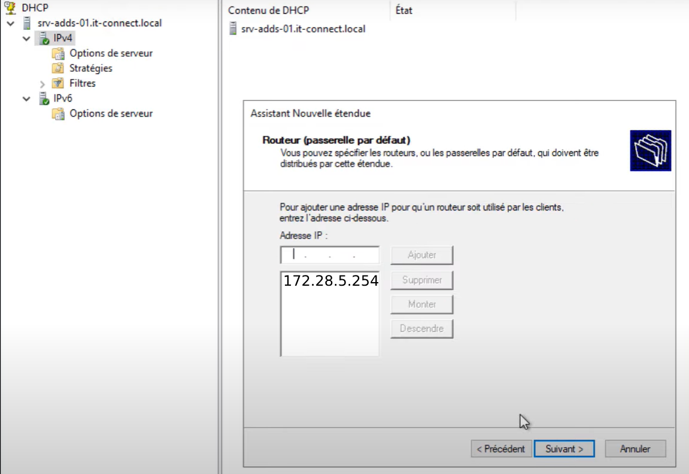

# 5/ Contrôleur de domaine 

##  **Installation de l'Active Directory ?** ##

Tout d'abord nous utiliserons un logiciel qui est dedié pour le **cloud computing** :

##  **Qu'est ce que Nutanix ?** ##

**Nutanix** est une entreprise spécialisée dans les **solutions de gestion de l'infrastructure informatique et du cloud**. Elle propose **une plateforme hyperconvergée qui combine stockage, calcul, virtualisation et gestion des ressources au sein d'un seul et même système**. Cette approche simplifie **la gestion des centres de données, permettant aux entreprises de déployer et de gérer leurs applications de manière plus efficace**.

La plateforme Nutanix est **conçue pour rendre l'infrastructure informatique plus flexible**, **évolutive et résiliente**. Elle permet aux entreprises de **réduire les coûts et la complexité associés à la gestion de leur infrastructure**, tout en offrant des performances accrues pour leurs applications.

En résumé, Nutanix propose une solution hyperconvergée qui **transforme la gestion de l'infrastructure informatique** en simplifiant les opérations et en **améliorant la flexibilité et la performance des applications**.

##  **Qu'elle configuration ?** ##

Pour la configuration de notre **VM (Virtual Machine)** Nutanix, on a tout d'abord rejoins le menu Nutanix, puis par la suite entrer les paramètres suivants :

**Configuration**

**Resources**

**Management**

##  **Installation de l'Active Directory** ##

Pour installer **l'Active Directory** nous sommes passés par l'ISO **Windows Server 2022**, une fois l'installation faite (la même installation qu'un ordinateur lambda)

Avant le paramètrage et l'installation des rôles souhaitaient on va configurer **une adresse IP statique à notre serveur** :

Une fois l'adresse IP attribuée nous irons sur cette fenêtre :

Ensuite nous devons installer **les différents rôles** que nous voulions que notre serveur gère, dans notre cas ce sera **le DNS**, **le DHCP** et **l'AD DS** :

Puis **next** jusqu'à la catégorie **"Confirmation"** :

###  **Active Directory Domain Services** ###

A la place du **mylab.local** entrer votre nom de domaine que vous voulez

Ensuite **next** jusqu'à **Additional Options** :

Et dans cette section entrez-y votre **nom de domaine** (dans l'exemple **MYLAB**)
Le notre se transformera par la suite par **local.chateauroux.sportludique.fr**

Puis plus rien à configurer sur l'AD DS plus qu'a appuyer sur **next** et **lancer l'installation** !

###  **DHCP** ###

Pour la configuration **DHCP** :

Tout d'abord, il a fallu réfléchir aux **étendues** qu'on voulait attribué pour les VLANS, dans notre cas nous avons choisis le **VLAN 215** qui est **attribué à tous les postes clients de notre réseau** qu'on a décidé d'appeler **"VLAN215_USERS"**

Pour se faire on ira **dans la section DHCP** puis nous arriverons sur cette fenêtre, il suffira de faire dans notre cas (IPV4) **faire un clic droit sur notre section donc IPV4**, puis **nouvelle étendue** :

####  **Configuration de l'étendue (DHCP)** ####

Pour ajouter un nom ça se trouvera à **la première étape de la création de l'étendue** (dans notre cas on l'a nommée **VLAN215_USERS**) :

En adresse de début on y inscrit : **172.28.5.1** qui correspond à **la première adresse du VLAN215 utilisable par un hôte** ainsi que **l'adresse de fin : 172.28.5.254**

Puis en longueur, **la longueur de notre masque donc 24 qui correspond à 255.255.255.0**

Ensuite nous pouvons aller à l'étape suivante qui est **d'exclure des adresses de l'étendue** créer avant, pour notre cas aucune adresse ce doit d'être exclue donc aucun paramètre attendu de notre part

Pour la durée du bail on a laissé **8 jours (valeur par défaut)** ce paramètre spécifie **la durée qu'un client peut utiliser une adresse IP dans l'étendue**.

A la fin de la configuration de la durée, on nous demande de **configurer les options DHCP maintenant ou plus tard** (on a choisi maintenant)

On procèdera alors à **la configuration des options DHCP** :

Dans la passerelle on y **configurera la passerelle choisie** et qui a était configurée en amont dans **notre Switch** : **172.28.5.254** pour **la passerelle du réseau USERS**

Normalement automatiquement **votre nom de domaine sera inscrit automatiquement** :

Pour finir **un dossier se créera dans la section IPV4** **au nom de votre étendue** ce qui correspondra à votre étendue :

A la fin de votre configuration DHCP dans la catégorie **Serveur Local** vous devriez avoir ceci :

