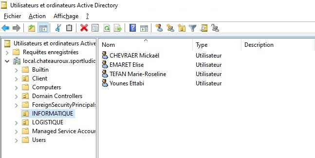
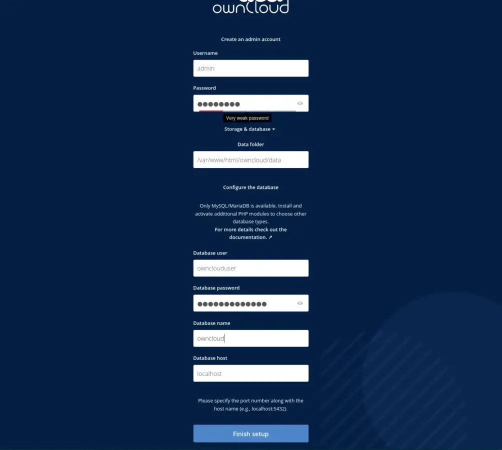
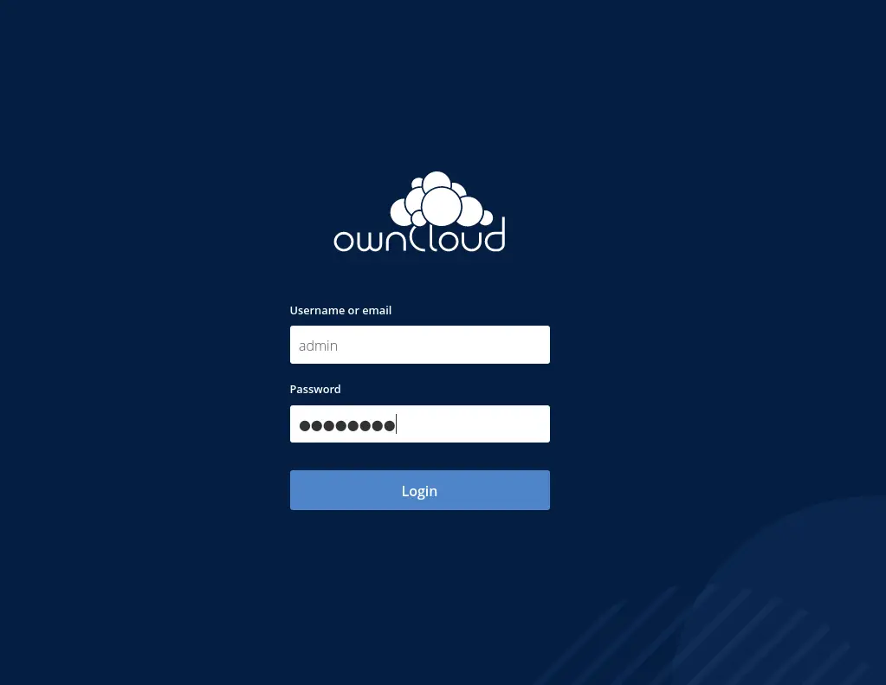
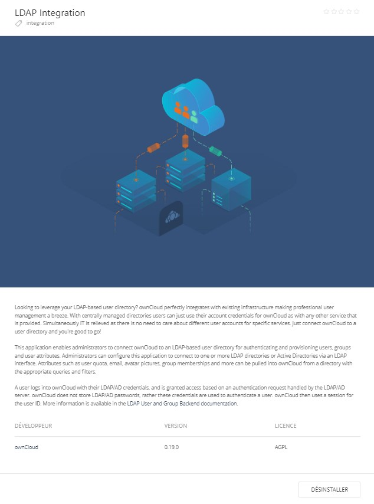
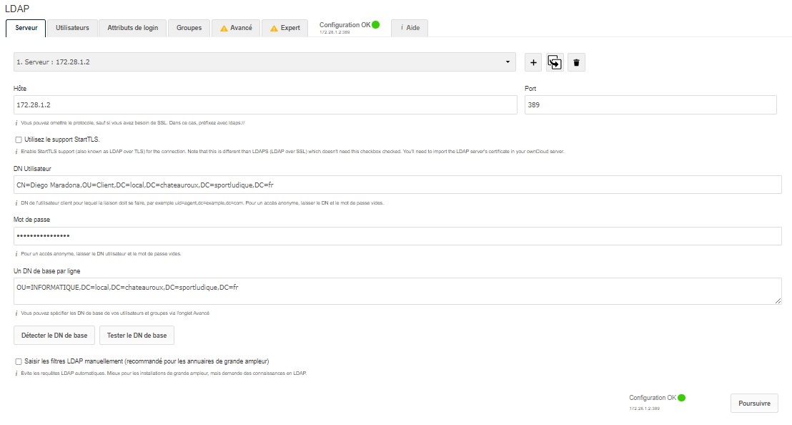
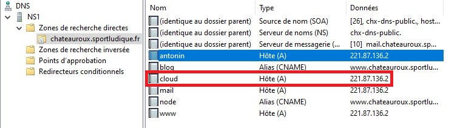
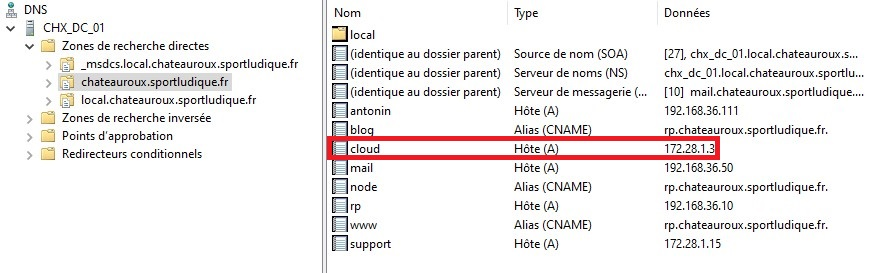
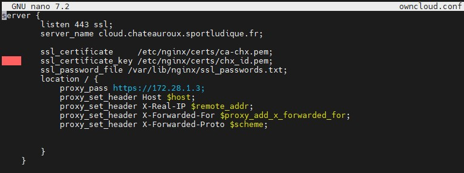
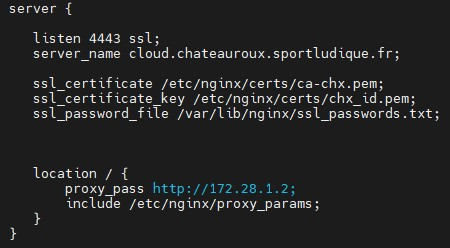
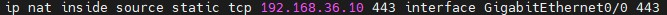

# 12/ OwnCloud

Mise en place d'Owncloud, plusieurs problèmes relevés : **Owncloud pas compatible avec PHP 8** et liaison LDAP. Accessible seulement pour les personnes présente dans une Unité d'Organisation bien défini (Informatique)

##  **Présentation des utilisateurs présent dans l'UO Informatique** ##

Les utilisateurs doivent avant tout déverouillez leur compte et en changeant le mot de passe de ce dernier pour que Owncloud le découvre comme **compte actif**

###  **Installation des pré-requis pour OwnCloud** ###

 ``sudo apt install apt-transport-https lsb-release ca-certificates wget``
 
 ``sudo apt install apache2 mariadb-server``

 ``sudo wget -O /etc/apt/trusted.gpg.d/php.gpg https://packages.sury.org/php/apt.gpg`` <- Pour PHP 7.4

 ``sudo apt install php7.4-{xml,intl,common,json,curl,mbstring,mysql,gd,imagick,zip,opcache} libapache2-mod-php7.4``

 ``sudo mysql_secure_installation``

 ``sudo mysql -u root -p``

    Création de la base de données :

 ``CREATE DATABASE owncloud;``
 ``CREATE USER 'ownclouduser'@'localhost' IDENTIFIED BY 'your_password';``
 ``GRANT ALL ON owncloud.* TO 'ownclouduser'@'localhost';``
 ``FLUSH PRIVILEGES;``
 ``EXIT;``

 ``wget https://download.owncloud.com/server/stable/owncloud-latest.tar.bz2`` <- OwnCloud

 ``sudo chown -R www-data:www-data /var/www/html/owncloud`` <- Les permissions

 ``sudo nano /etc/apache2/sites-available/owncloud.conf`` <- Conf Owncloud

  ``Alias /owncloud "/var/www/html/owncloud/"``

 ``<Directory /var/www/html/owncloud/>``
   ``Options +FollowSymlinks``
   ``AllowOverride All``

   ``<IfModule mod_dav.c>``
    ``Dav off``
   ``</IfModule>``

   ``SetEnv HOME /var/www/html/owncloud``
   ``SetEnv HTTP_HOME /var/www/html/owncloud``
 ``</Directory>``

  ``sudo a2ensite owncloud`` <- Activation du site Owncloud
  ``sudo a2enmod rewrite headers env dir mime``
  ``sudo systemctl restart apache2``

  Plus qu'à configurer sur l'interface web

 
####  **Configuration interface web Owncloud** ####

#####  **Résolution DNS Privé et Public** #####

######  **Reverse Proxy NGINX** ######

######  **Règle NAT du serveur** #######

