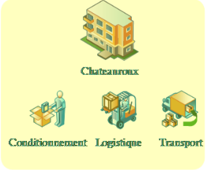

# 2/ Composition du site de Châteauroux #

| Nombre d'utilisateurs              | 81   |
| :---------------:|:----------------------:|
|Nombres de stations de travail      |50    | 
|fixes                               |40    | 
|portables                           |10    | 
|Nombre de serveurs                  |3     | 

## Détails des équipements du site ##

|Nom               |Fonction                           |OS
|:----------------:|---------------------------------  |:--------------------------:
|**CHX_DC_01**     |Contrôleur principal de domaine    | Windows server 2008 R2
|                  |Serveur Primaire DNS               | Domaine : chateauroux.local
|                  |Serveur DHCP                       | 
|                  |Serveur de fichiers                | 
|**CHX_DC_01**     |Contrôleur principal de domaine    |Windows server 2008 R2 
|                  |Serveur Secondaire DNS             |
|                  |Serveur de fichiers                |

## Situation et répartition géographique 

Situé idéalement au centre de la France, les stocks et la logistique sont la spécialité de ce site.