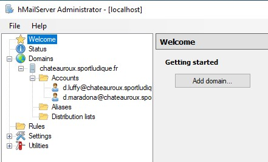
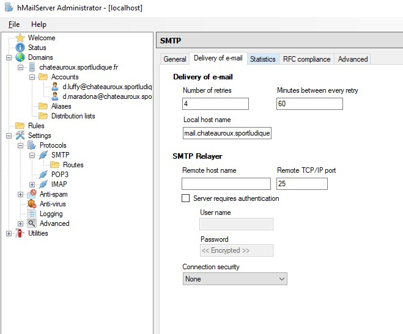
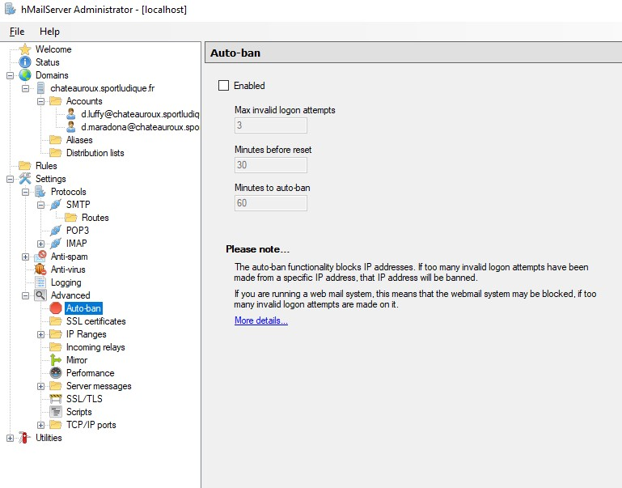
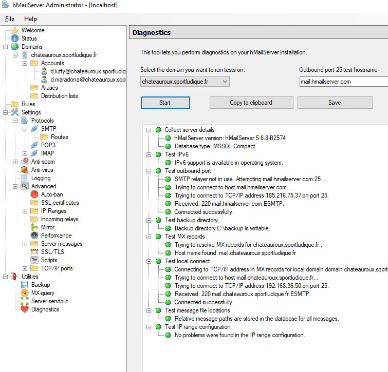
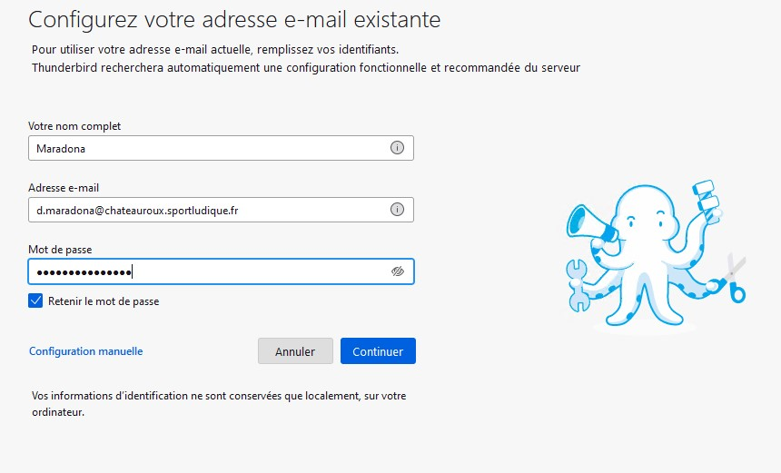
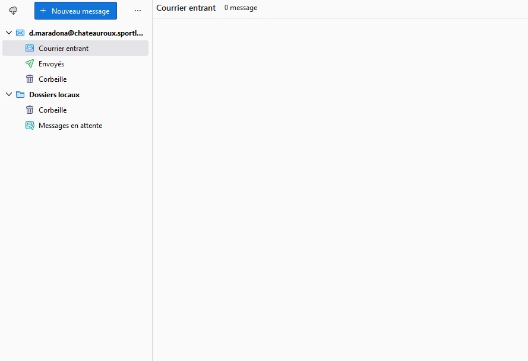

# 14/ Serveur de messagerie

Nous avons utilisés HMailServer

Ajouter 2 comptes comme on peut le voir sur la capture d'écran d'au-dessus

("Local host name" est a configurer en amont sur le DNS)
Local host name est a rentrer dans Settings --> Protocols --> SMTP

!!! NE PAS OUBLIER DE DESACTIVER **L'AUTOBAN** !!!

Vérifier si tout est opérationnel

**Thunderbird**

Puis connecter

