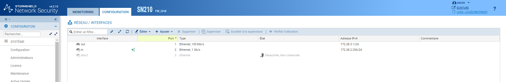
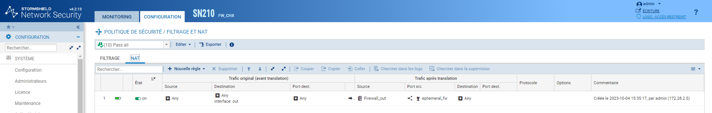
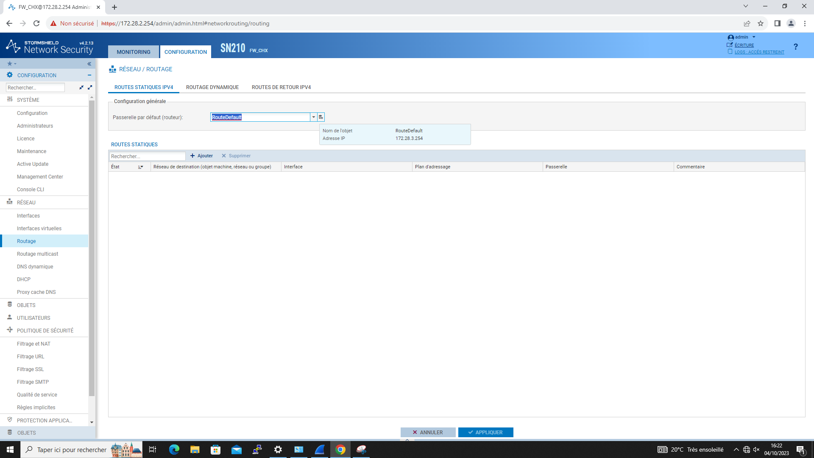
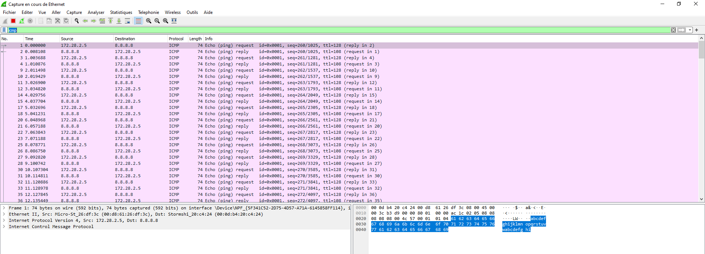
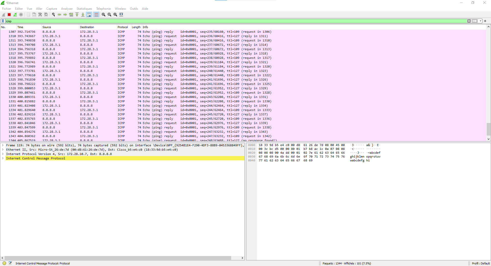
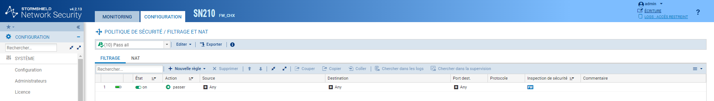

# 6/ Pare-Feu 

##  **Installation du Pare-Feu** ##

**Configuration du NAT :**

**Route par défaut :**

**Capture des trames avant translation (même réseau que le firewall) :**

**Côté client :**

**On active le passall dans les règles de filtrage pour permettre à toutes les entrées d'accèder au réseau:**

